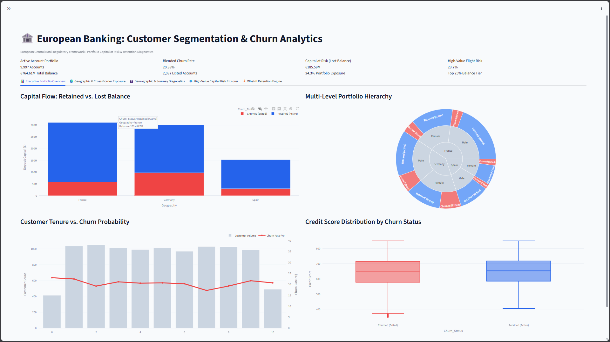
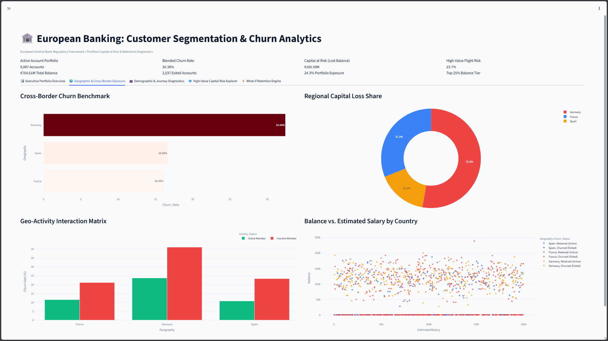
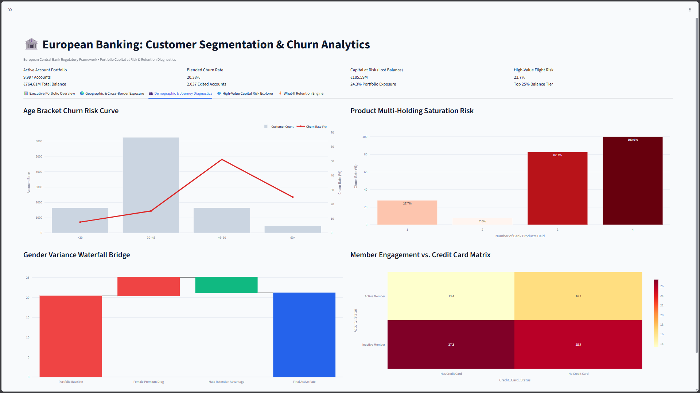
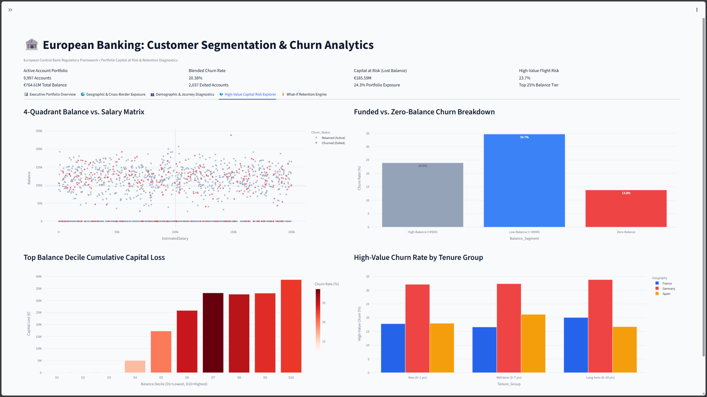
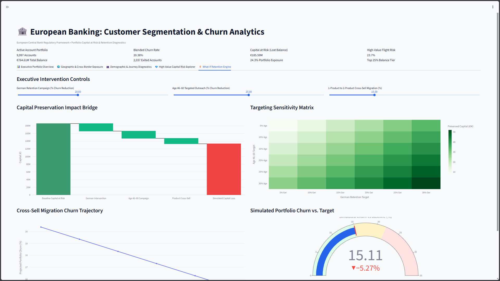

<div align="center">

# 🏦 European Banking Customer Segmentation & Churn Analytics Platform

**A Board-Grade, Interactive Diagnostic Engine for Retail Deposit Attrition Risk**
*France · Germany · Spain — 10,000 Accounts · €764.86M Portfolio*

[](https://streamlit.io)
[](https://www.python.org)
[](https://plotly.com)
[](LICENSE)
[](#)

</div>

---

## 📋 Executive Overview

### The Problem
A blended **20.37% account-level churn rate** across a 10,000-account European retail deposit portfolio masks a far more severe underlying reality: **24.26% of total deposit *value*** — **€185.59M** of a **€764.86M** book — has already exited the bank. This platform was built to answer the question the headline KPI cannot: *which accounts, geographies, and life stages are driving disproportionate capital loss, and where should intervention capital be spent first?*

### Business Impact at a Glance
| Metric | Value |
|---|---|
| Total Capital at Risk | **€185.59M** (24.26% of ledger) |
| Total Accounts Analyzed | **10,000** across 🇫🇷 France · 🇩🇪 Germany · 🇪🇸 Spain |
| Highest-Risk Geography | 🇩🇪 **Germany — 32.44% churn** (GRI 1.59) |
| Highest-Risk Demographic | **Ages 46–60 — 51.12% churn** |
| Optimal Retention Structure | **2-Product relationships — 7.58% churn** |

### Core Findings
- 🇩🇪 **German Capital Exposure** — Germany holds 25.1% of accounts but generates **52.8%** of all lost balance (GRI = 1.59), making it the single largest concentration risk in the portfolio.
- 👥 **Pre-Retirement Wealth Drain** — The 46–60 age cohort churns at **51.12%**, roughly 2.5x the portfolio baseline, and accounts for over 40% of both churn events and lost balance.
- 🔗 **Two-Product Stickiness** — Accounts holding exactly **2 products** are the most stable configuration in the dataset (7.58% churn), while 3- and 4-product accounts churn at 82.71% and 100.00% respectively — a cross-sell governance signal, not a loyalty win.

This platform operationalizes those findings into a live, filterable, executive-facing analytics dashboard.

---

## 🖥️ Interactive 5-Tab Dashboard Layout

The Streamlit application (`app.py`) is organized into five purpose-built analytical tabs, each combining Plotly visualizations designed for both analyst drill-down and executive presentation.

### 🟦 Tab 1 — Executive Portfolio Overview
| Visual | Purpose |
|---|---|
| **Capital Flow Bar** | Retained vs. churned deposit balance, portfolio-wide |
| **Portfolio Sunburst** | Hierarchical breakdown: Geography → Product Count → Churn Status |
| **Tenure Curve** | Churn rate trend across customer tenure bands |
| **Credit Score Violin** | Distribution of credit scores by churn outcome |

### 🟩 Tab 2 — Geographic & Cross-Border Exposure
| Visual | Purpose |
|---|---|
| **Cross-Border Churn Benchmark** | France vs. Germany vs. Spain churn rate comparison |
| **Regional Capital Loss Donut** | Share of total €185.59M lost balance by country |
| **Geo-Activity Matrix** | Active/inactive membership rate by geography |
| **Balance vs. Salary Scatter** | Deposit balance vs. estimated income, colored by churn |

### 🟨 Tab 3 — Demographic & Journey Diagnostics
| Visual | Purpose |
|---|---|
| **Age Risk Dual-Axis Curve** | Churn rate (line) vs. account volume (bar) by age band |
| **Product Saturation Step Chart** | Churn rate progression across 1→4 product depth |
| **Gender Disparity Waterfall** | Female (25.07%) vs. Male (16.46%) churn decomposition |
| **Engagement Heatmap** | Churn rate by activity status × product count |

### 🟧 Tab 4 — High-Value Capital Risk Explorer
| Visual | Purpose |
|---|---|
| **4-Quadrant Balance vs. Salary Matrix** | Segments customers into risk quadrants for targeting |
| **Funded vs. Zero-Balance Donut** | Churn split: funded (24.08%) vs. zero-balance (13.82%) |
| **Top-Decile Loss Bar** | Concentration of lost balance among top 10% of accounts |
| **Tenure × High-Value Bar** | Long-tenured, high-balance account attrition exposure |

### 🟥 Tab 5 — What-If Retention Engine
| Visual | Purpose |
|---|---|
| **Capital Preservation Waterfall** | Simulated €48.2M recovery from combined interventions |
| **Targeting Sensitivity Heatmap** | Churn reduction sensitivity by intervention intensity |
| **Product Cross-Sell Migration Curve** | Projected impact of 1→2 product migration campaigns |
| **ECB Regulatory Gauge** | Live gauge tracking blended churn vs. <15% target threshold |

---

## 🖼️ Dashboard Screenshots

> Place screenshot images in **`assets/screenshots/`**, named `s1.png` through `s5.png` — one per dashboard tab, in order.

| # | Tab | Preview |
|---|---|---|
| s1 | Executive Portfolio Overview |  |
| s2 | Geographic & Cross-Border Exposure |  |
| s3 | Demographic & Journey Diagnostics |  |
| s4 | High-Value Capital Risk Explorer |  |
| s5 | What-If Retention Engine |  |

<details>
<summary><strong>Full-size previews</strong> (click to expand)</summary>

#### s1 — Executive Portfolio Overview


#### s2 — Geographic & Cross-Border Exposure


#### s3 — Demographic & Journey Diagnostics


#### s4 — High-Value Capital Risk Explorer


#### s5 — What-If Retention Engine


</details>

---

## 🗂️ Repository Directory Structure

```
european-banking-churn-analytics/
├── .streamlit/
│   └── config.toml              # Theme, layout, and server configuration
├── assets/
│   ├── logo.png                  # Platform branding
│   └── screenshots/              # Dashboard preview images — s1.png … s5.png (one per tab)
├── data/
│   └── raw/
│       └── churn_portfolio.csv   # Source dataset (10,000 accounts)
├── docs/
│   ├── research_paper.md         # Full academic-grade research paper
│   └── executive_summary.md      # Board-level executive briefing
├── src/
│   ├── __init__.py
│   ├── data_loader.py            # Ingestion, validation, and binning logic
│   ├── metrics.py                # GRI, churn rate, and capital-at-risk calculators
│   ├── charts/
│   │   ├── overview_charts.py    # Tab 1 visualizations
│   │   ├── geo_charts.py         # Tab 2 visualizations
│   │   ├── demo_charts.py        # Tab 3 visualizations
│   │   ├── risk_charts.py        # Tab 4 visualizations
│   │   └── simulation_charts.py  # Tab 5 visualizations
│   └── simulation_engine.py      # What-If scenario modeling logic
├── app.py                        # Streamlit entry point (5-tab dashboard)
├── requirements.txt              # Pinned dependency versions
├── LICENSE                       # MIT License
└── README.md                     # You are here
```

---

## 📐 Key Statistical & Formula Reference

| Metric | Formula | Interpretation |
|---|---|---|
| **Segment Churn Rate** | `Churned Accounts (segment) ÷ Total Accounts (segment)` | Headcount-based attrition rate within any cohort (geography, age, product tier, etc.) |
| **Geographic Risk Index (GRI)** | `(Share of Lost Balance)ᵢ ÷ (Share of Total Accounts)ᵢ` | Normalizes capital loss against portfolio footprint; GRI > 1.0 signals disproportionate capital-risk concentration |
| **Activity Drag Spread** | `Churn Rate (Inactive) − Churn Rate (Active)` | Quantifies the retention penalty for disengaged members (portfolio value: **+12.58 pts**) |
| **Capital at Risk (CaR)** | `Σ Lost Balance ÷ Total Deposited Portfolio` | Balance-weighted attrition rate; distinct from and typically exceeds headcount churn rate |

---

## 🚀 Quickstart & Local Installation

```bash
# 1. Clone the repository
git clone https://github.com/your-org/european-banking-churn-analytics.git
cd european-banking-churn-analytics

# 2. Create and activate a virtual environment
python3 -m venv venv
source venv/bin/activate        # macOS / Linux
venv\Scripts\activate           # Windows

# 3. Install dependencies
pip install -r requirements.txt

# 4. Launch the dashboard
streamlit run app.py
```

The application will be available locally at **`http://localhost:8501`**.

---

## 📦 Deliverables Summary

| Deliverable | Location / Link |
|---|---|
| **Live Streamlit App** | (https://european-bank-churnanalytics.streamlit.app/) |
| **Full Research Paper** | [`docs/research_paper.pdf`](docs/research_paper.pdf) |
| **Executive Summary (Board Briefing)** | [`docs/executive_summary.pdf`](docs/executive_summary.pdf) |

---

<div align="center">

**Built for Boards, CROs, and Regulators — Not Just Analysts.**

</div>
